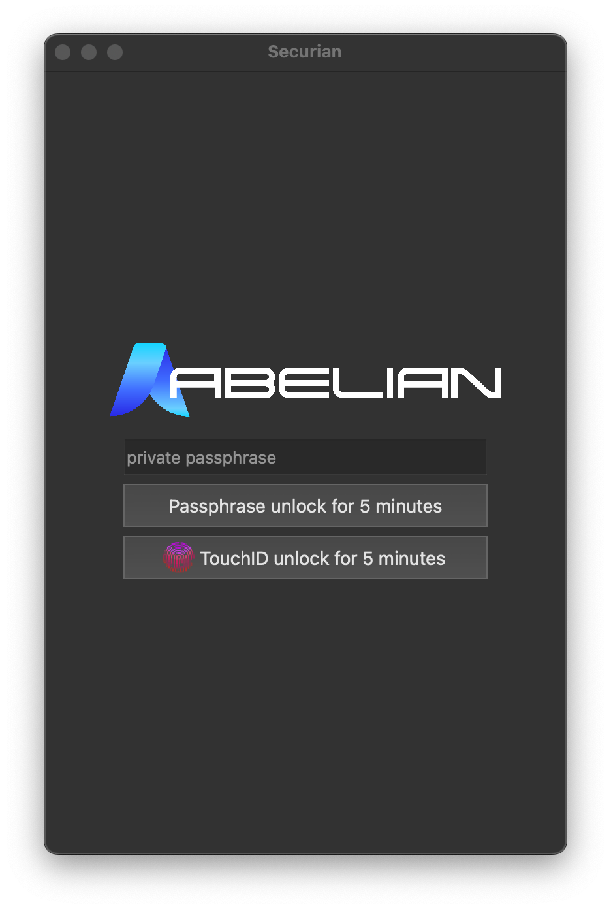

# Securian: the 1st GUI wallet for Abelian

## Video Demo

## Prerequisites

1. Setup Abelian full node miner or use their RPC. Follow the #abel-wallet channel on their [Discord](https://discord.gg/5rrDxP29hx) to setup Abewallet. Make sure you save your mnemonic and passphrases.
2. Create a `.env` file in the root directory following the format in `sample.env`.

## Usage

`npm run start`

## Limitations

* Abelian ScoreTM and personalized recommendations is currently not computed since explorer and chain statistics are not available. You can check out this [POC on Figma](https://www.figma.com/proto/6VdUnZGlQoZPgGoJrY9fkj/ABELIAN-PRO?node-id=3%3A2&scaling=min-zoom&page-id=0%3A1&starting-point-node-id=3%3A2).
* The zkOTP implementation is currently a dummy input field. The detailed implementation can be found on [socathie/zkOTP](https://github.com/socathie/zkOTP).
